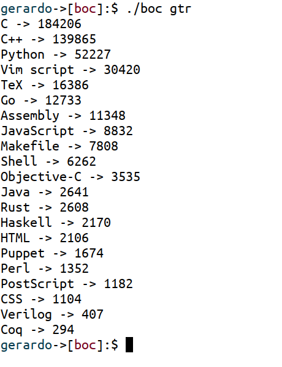

# boc

`boc` is a simple utility to count the bytes of code for a given Github user.

### setup

clone the repository:
```
$ git clone https://github.com/gtr/boc.git; cd boc
```

build:
```
$ go build
```

read [this](https://help.github.com/en/github/authenticating-to-github/creating-a-personal-access-token-for-the-command-line) article on how to create an access token for the GitHub API. make sure you select access for repositories.

once you have the access token, create a file `config.json`:

```
$ touch config.json; 
```

and edit it to include this:

```json
{
    "MY_KEY": "<YOUR-KEY-HERE>"
}
```

paste your access key as a value to `MY_KEY` as shown above.

### usage

to use the utility, run the the `boc` binary followed by the desired username.

```
$ ./boc gtr
```

output for my username `gtr`:


